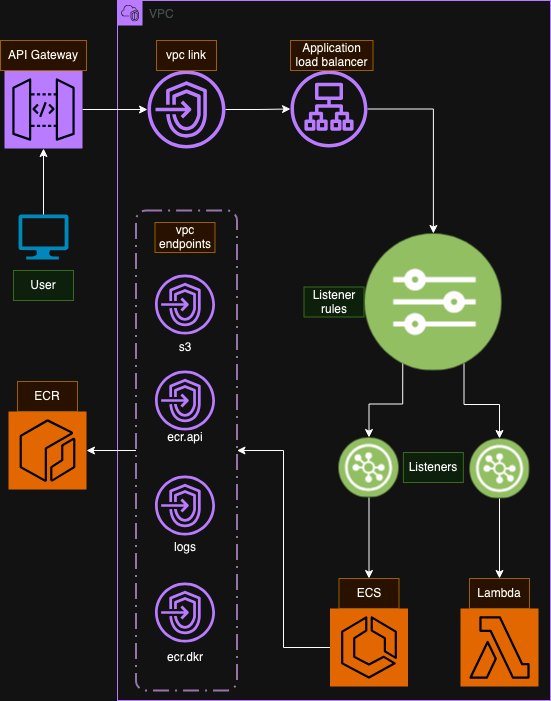

# weighted-target-traffic

Send weighted (percentage of) traffic to different aws resources. 

In this use case we can incrementally move endpoints to ECS from Lambda.



`Deploy` workflow - push on `main` trigger

1. **repo** Setup ECR and S3 repositories.
2. **network** Apply vpc link and api gateway ingress along with load balancer and rules.
3. **security** Create security groups which are imported via `data "aws_security_group"`
4. **image** Build image if changes to `src/*` detected
5. **code** Build Lambda code as zip if changes to `src/*` detected
6. **ecs** Apply ECS cluster, service and task. Rolling deployment only.
7. **lambda** Apply Lambda.


`Destroy` workflow - manual trigger

1. **ecs** Destroy ecs service and task.
2. **lambda** Destroy lambda.
3. **network** Destroy vpc link and api gateway ingress resources.
4. **repo** Destroy ecr, images and lambda s3 zips.
5. **security** Destroy security groups last [THIS AVOIDS CI PAIN](https://github.com/hashicorp/terraform-provider-aws/issues/2445)

## path weighting rules

- Passed in as `terraform apply -var='weighted_rules={}'` default value json shown below.
- For each path define weighting to lambda and/or ecs.
- In the below:
  - `host` will be weighted 50/50 to ecs/lambda. Using the `split` strategy.
  - `small-woodland-creature` will go to ecs only.
  - `ice-cream-flavour` will go to lambda only.

```hcl
{
    "ice-cream-flavour" = {
      strategy = "lambda"
    },
    "small-woodland-creature" = {
      strategy = "ecs"
    },
    "host" = {
      strategy = "split"
      ecs_percentage_traffic = 50
      lambda_percentage_traffic = 50
    }
  }
```

- Default values are set with `terraform apply -var='default_weighting={strategy="lambda"}'` this example sends all traffic to lambda.
  - a split as a defualt can be achieved with `terraform apply -var='default_weighting={strategy="split",ecs_percentage_traffic=30,lambda_percentage_traffic=70}'`. Which would send 30% traffic to ecs and 70% to lambda.
 

## terraform

Required deployment iam privileges.

```json
[
    "dynamodb:*", 
    "s3:*", 
    "ecr:*", 
    "iam:*", 
    "ecs:*", 
    "ec2:*", 
    "elasticloadbalancing:*", 
    "logs:*", 
    "cloudwatch:*", 
    "apigateway:*", 
    "lambda:*"
]
```

## ci config

Required github action variables.
- `AWS_ACCOUNT_ID`
- `AWS_REGION`
- `AWS_ROLE` role with above deployment privileges
